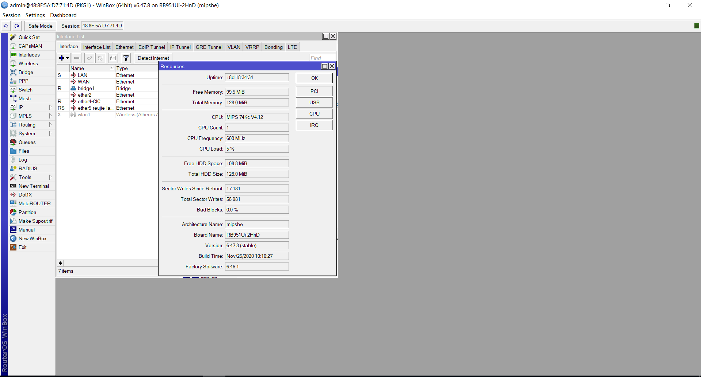

Saya adalah seorang programmer pengalaman di laravel, mysql, android native java, menguasai API, penyedia sistem di perusahaan, customer display analythic dashboard di monitor resepsionis, memahami server ubuntu provide semua kebutuhan production project pada sistem (backup otomatis database secara berkala pada ubuntu /home/backup/mysql/, serta menggunakan nginx), dan sedang pelajari n8n. dan saya sedang ingin mempelajari winbox, apa itu winbox, apa yang bisa saya lakukan. berikut gambar sebagai referensi pada winbox di kantor saya



WinBox adalah aplikasi manajemen **MikroTik RouterOS** berbasis GUI. Fungsinya seperti “control panel” untuk router kantor: internet, LAN, firewall, VPN, bandwidth, hotspot, DNS, DHCP, monitoring traffic, dan routing.

Dari gambar kantor Anda terlihat device:

**MikroTik RB951Ui-2HnD**
Router kecil dengan WiFi built-in.
RouterOS **v6.47.8**, uptime 18 hari, RAM 128 MB, storage 128 MB.

Yang bisa Anda lakukan dengan WinBox:

1. **Mengatur Internet / WAN**

   * Setting IP dari ISP
   * PPPoE
   * Static IP
   * NAT masquerade
   * DNS internet kantor

2. **Mengatur LAN kantor**

   * DHCP Server
   * IP Address gateway
   * Bridge LAN
   * Segmentasi VLAN
   * IP untuk komputer, printer, CCTV, server Ubuntu

3. **Firewall & Security**

   * Blok akses dari luar
   * Allow akses tertentu ke server
   * Port forwarding ke aplikasi Laravel / CCTV / dashboard
   * Blok situs atau IP tertentu
   * Proteksi brute force

4. **Bandwidth Management**

   * Limit internet per user
   * Prioritas untuk server, admin, meeting, CCTV
   * Simple Queue / Queue Tree
   * Monitoring user yang paling banyak pakai bandwidth

5. **Monitoring Jaringan**

   * Lihat traffic interface WAN/LAN
   * Cek device aktif
   * Cek log koneksi
   * Torch untuk melihat IP mana yang memakai bandwidth besar

6. **VPN**

   * Remote akses ke jaringan kantor
   * L2TP/IPSec
   * SSTP
   * WireGuard kalau RouterOS versi baru
   * Cocok untuk akses server kantor dari luar

7. **Backup & Maintenance**

   * Backup konfigurasi router
   * Export konfigurasi ke file `.rsc`
   * Upgrade RouterOS
   * Restore setting jika router rusak

Untuk background Anda sebagai programmer Laravel/server, bagian WinBox yang paling berguna dipelajari dulu:

**Urutan belajar terbaik:**

1. **Interfaces**
   Pahami mana port WAN, LAN, bridge, WiFi.

2. **IP > Addresses**
   Melihat IP router, gateway LAN, dan segmentasi jaringan.

3. **IP > DHCP Server**
   Mengatur pembagian IP otomatis ke komputer kantor.

4. **IP > Firewall > NAT**
   Penting untuk internet dan port forwarding ke server Ubuntu.

5. **IP > Firewall > Filter Rules**
   Untuk keamanan jaringan kantor.

6. **Queues**
   Untuk limit bandwidth user/karyawan.

7. **Tools > Torch**
   Untuk analisa traffic real-time.

8. **Files / Backup**
   Wajib sebelum ubah setting apapun.

Saran saya sebelum belajar praktik:

**Backup dulu konfigurasi MikroTik:**

Masuk WinBox → **Files** → **Backup**
Lalu juga via Terminal:

```bash
/export file=backup-config-before-learning
/system backup save name=backup-full-before-learning
```

Jangan langsung ubah bagian **WAN, NAT, DHCP, Bridge, Firewall** sebelum backup, karena bisa membuat internet kantor putus.

Kalau disambungkan dengan skill Anda, MikroTik ini bisa sangat berguna untuk:

* membuat akses remote aman ke server Laravel
* port forwarding ke aplikasi internal
* pisah jaringan staff, guest, server, CCTV
* monitoring bandwidth dashboard
* auto backup config router
* integrasi monitoring ke n8n/Telegram
* membuat alert jika internet down
* menjaga server Ubuntu production lebih aman dari akses luar

Coba ilustrasikan semisal ada perusahaan/kantor yang baru di buka dan ingin memulai infrastruktur jaringan serta berikan opsi pendekatan yang sejenis dengan winbox atau ada hal lain yang menjadi konsen pengetahuan

Bayangkan ada perusahaan baru seperti:

> **PT Digital Maritim Nusantara**
> Kantor baru 2 lantai
> 25 karyawan
> Ada:
>
> * divisi accounting
> * marketing
> * operasional kapal
> * server aplikasi internal Laravel
> * CCTV
> * absensi mobile
> * TV dashboard analytics resepsionis
> * printer network
> * WiFi tamu
> * backup database otomatis ke Ubuntu server

Dengan background Anda sekarang, sebenarnya Anda sudah masuk level:

> “Fullstack Infrastructure & System Engineer”

karena Anda bukan hanya coding aplikasi, tapi juga:

* deploy production
* server Ubuntu
* database
* networking dasar
* monitoring
* API
* dashboard
* automation

Sekarang tinggal naik ke:

* Network Infrastructure
* Enterprise Security
* Monitoring
* Automation Network

---

# Gambaran Infrastruktur Kantor Modern

## 1. INTERNET ISP

Misalnya:

* Biznet Dedicated
* Indihome Bisnis
* Telkom Astinet

Internet masuk ke:

# 2. ROUTER (MikroTik / pfSense / Ubiquiti)

Di sinilah WinBox berperan.

Contoh tugas MikroTik:

* membagi internet
* firewall
* VPN
* VLAN
* hotspot guest
* bandwidth management
* routing

Contoh:

```text
Internet
   |
MikroTik Router
   |
Switch Managed
   |
-----------------------
|      |      |      |
PC   CCTV   Server  WiFi
```

---

# 3. SWITCH MANAGED

Contoh:

* TP-Link Omada
* Cisco
* Ubiquiti
* MikroTik CRS

Fungsi:

* distribusi jaringan
* VLAN
* segmentasi device

Misalnya:

* VLAN 10 → Staff
* VLAN 20 → Server
* VLAN 30 → CCTV
* VLAN 40 → Guest

Agar:

* tamu tidak bisa akses server
* CCTV terisolasi
* keamanan lebih baik

---

# 4. ACCESS POINT / WIFI

Contoh:

* UniFi
* Omada
* MikroTik CAPsMAN

Bisa dibuat:

* WiFi Staff
* WiFi Guest
* captive portal
* voucher hotspot

---

# 5. SERVER UBUNTU

Ini area yang sudah Anda kuasai.

Misalnya:

* Laravel app
* MySQL
* Nginx
* API
* Queue
* Scheduler
* Backup otomatis

Contoh production:

```text
Ubuntu Server
├── Laravel ERP
├── Attendance API
├── Dashboard Analytics
├── MySQL
├── Redis
├── Nginx
└── Backup Script
```

---

# 6. DASHBOARD ANALYTICS TV

Ini kekuatan unik Anda.

Banyak programmer belum tentu bisa:

* real-time TV dashboard
* websocket/socket.io
* D3.js analytics
* operational monitor

Contoh:

* vessel status
* pending invoice
* manpower onboard
* ship movement
* attendance live

---

# Sekarang WinBox masuk di mana?

WinBox adalah alat untuk mengatur “jalan raya” sistem Anda.

Kalau Laravel = isi bisnis
Maka MikroTik = lalu lintas bisnis.

---

# Contoh Real Use Case Kantor

## CASE 1 — Server Laravel Bisa Diakses Dari Luar

Anda punya:

* ERP internal
* attendance app
* dashboard

Agar bisa diakses:

```text
Internet
 ↓
MikroTik NAT
 ↓
Ubuntu Nginx
 ↓
Laravel
```

MikroTik:

* port forwarding
* firewall
* SSL forwarding
* VPN security

---

# CASE 2 — CCTV Jangan Ganggu Internet Kantor

CCTV makan bandwidth besar.

Solusi:

* VLAN CCTV
* queue bandwidth
* limit upload

---

# CASE 3 — Guest WiFi Aman

Tamu tidak boleh akses:

* printer
* NAS
* server
* database

MikroTik:

* hotspot isolation
* VLAN guest
* firewall rule

---

# CASE 4 — Remote Kerja Dari Rumah

Anda ingin akses:

* phpMyAdmin
* SSH Ubuntu
* ERP internal

Solusi:

* VPN MikroTik

Bukan expose port langsung.

---

# Hal-Hal yang Sangat Bagus Dipelajari Selanjutnya

Karena Anda sudah kuat di backend/server.

---

# 1. NETWORKING FUNDAMENTAL

Wajib kuat:

* subnetting
* routing
* NAT
* DNS
* VLAN
* DHCP
* firewall
* TCP/UDP

Ini fondasi semuanya.

---

# 2. MIKROTIK

Pelajari:

* WinBox
* Terminal RouterOS
* firewall
* mangle
* queue
* VPN
* failover dual ISP

---

# 3. UBUNTU SERVER HARDENING

Naik level ke:

* fail2ban
* UFW/IPTables
* CrowdSec
* reverse proxy
* SSL automation
* Docker

---

# 4. DOCKER & CONTAINER

Ini sangat penting sekarang.

Deploy:

* Laravel
* Redis
* Queue
* n8n
* Grafana
* Prometheus

jadi lebih clean.

---

# 5. MONITORING SYSTEM

Ini sangat powerful untuk perusahaan.

Contoh:

* Grafana
* Prometheus
* Zabbix
* Uptime Kuma

Monitor:

* server
* internet
* bandwidth
* CPU
* storage
* CCTV online/offline

---

# 6. N8N AUTOMATION

Ini cocok sekali dengan skill Anda.

Contoh:

## Auto Alert Internet Down

```text
MikroTik
↓
Webhook
↓
n8n
↓
Telegram
```

“Internet kantor down sejak 09:12”

---

## Backup Monitoring

```text
Ubuntu Backup Script
↓
n8n
↓
Google Drive
↓
Telegram Report
```

---

# 7. CLOUD & VPS

Pelajari:

* Oracle Cloud
* AWS Lightsail
* Hetzner
* Cloudflare Tunnel

---

# 8. SECURITY

Ini sangat penting.

Pelajari:

* VPN
* reverse proxy
* rate limiting
* WAF
* brute force prevention
* SSH hardening

---

# Tools yang Sejenis atau Berkaitan Dengan WinBox

## MikroTik Ecosystem

* WinBox
* The Dude (monitoring)
* CAPsMAN
* RouterOS CLI

---

# Alternatif Enterprise Networking

## 1. Ubiquiti UniFi

UI lebih modern.

Cocok:

* kantor modern
* monitoring visual
* AP management

---

## 2. TP-Link Omada

Mirip UniFi tapi lebih murah.

---

## 3. pfSense

Firewall enterprise berbasis FreeBSD.

Sangat powerful.

Banyak dipakai:

* data center
* perusahaan besar

---

## 4. Cisco

Level enterprise besar.

Dipakai:

* bank
* telco
* enterprise

---

# Roadmap Paling Cocok Untuk Anda

Menurut saya:

## Tahap 1

* MikroTik dasar
* subnet
* VLAN
* firewall
* VPN

## Tahap 2

* Docker
* monitoring
* Grafana
* Prometheus

## Tahap 3

* automation n8n
* observability
* HA server
* reverse proxy

## Tahap 4

* DevOps
* Kubernetes
* CI/CD
* Infrastructure automation

---

# Potensi Karir Anda Sangat Besar

Karena kombinasi Anda jarang:

* programmer Laravel
* Android native
* server Ubuntu
* production deployment
* networking
* analytics dashboard
* automation

Di perusahaan kecil-menengah, skill seperti ini bisa menggantikan:

* backend developer
* sysadmin
* network engineer
* DevOps junior
* IT infrastructure

Dan untuk perusahaan shipping/logistics seperti PKG, skill ini sangat bernilai karena operasional sangat bergantung pada:

* internet stabil
* server internal
* monitoring
* dashboard
* akses remote
* data realtime.


